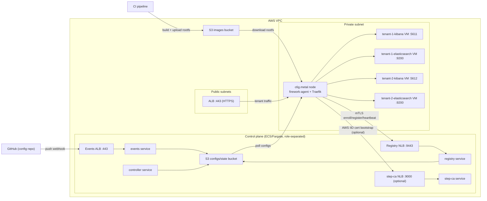

# Firework Deployment Example

> **Not production-ready.** This is an example deployment intended for demonstration and learning purposes only. It is not hardened, audited, etc.

Example AWS and GCP deployments of [Firework](https://github.com/artemnikitin/firework) using Packer and Terraform.

## Related repositories

- [firework](https://github.com/artemnikitin/firework) — The orchestrator itself
- [firework-gitops-example](https://github.com/artemnikitin/firework-gitops-example) — Example GitOps configuration repository

## AWS architecture



## Deployment flow

1. Choose a provider and configure the permissions described in `iam-policies/<provider>`.
2. Build the node image with `packer/<provider>`.
3. Deploy `terraform/control-plane/<provider>`.
4. Deploy `terraform/data-plane/<provider>`.
5. Push configs/images and let the agent reconcile microVMs.

## Detailed Guides

- AWS: [Packer](packer/aws/README.md), [control plane](terraform/control-plane/aws/README.md), [data plane](terraform/data-plane/aws/README.md)
- GCP: [Packer](packer/gcp/README.md), [control plane](terraform/control-plane/gcp/README.md), [data plane](terraform/data-plane/gcp/README.md)

## Key Notes

- Deploy order matters: control-plane first, data-plane second.
- Nodes are in private subnets; use AWS Session Manager for access — no SSH exposed.
- ALB serves HTTPS (TLS 1.2/1.3); host-based routing per tenant is handled by Traefik on the nodes.
- Optional step-ca service can issue short-lived node certs via AWS IID instead of static bootstrap tokens.
- Observability is managed as code in Terraform (dashboards, logs, access logs, metric filters).

For GCP, the control-plane roles run on separate Compute Engine VMs behind
passthrough Network Load Balancers. The x86_64 data plane is a private managed
instance group using nested virtualization, Cloud NAT, GCS, and a global HTTPS
load balancer to Traefik. See the GCP guides above for DNS delegation and TLS
prerequisites.

## Cleanup

Destroy each provider in reverse order:

```bash
cd terraform/data-plane/aws && terraform destroy
cd ../../control-plane/aws && terraform destroy

cd terraform/data-plane/gcp && terraform destroy
cd ../../control-plane/gcp && terraform destroy
```
