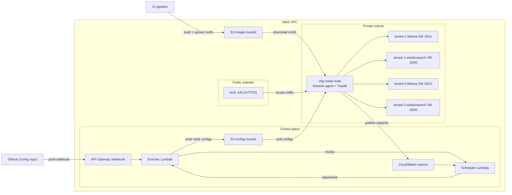

# Firework Deployment Example

Reference deployment of [Firework](https://github.com/artemnikitin/firework) on AWS using Packer (for building AMI) + Terraform.

## Related repositories

- [firework](https://github.com/artemnikitin/firework) — The orchestrator itself
- [firework-gitops-example](https://github.com/artemnikitin/firework-gitops-example) — Example GitOps configuration repository

## Architecture



## Deployment Flow

0. Make sure that you are using an AWS account with correct permissions to deploy all the resources. See `iam-policies` folder for more details.
1. Build AMI for EC2 instance(s) with Packer.
2. Deploy control-plane stack (creates webhook, Lambdas, config bucket).
3. Deploy infra and data-plane (creates network, EC2 instances, ALB, etc).
4. Push configs/images and let the agent reconcile microVMs.

## Detailed Guides

- Packer AMI build: [packer/README.md](packer/README.md)
- Control plane Terraform stack: [terraform/control-plane/README.md](terraform/control-plane/README.md)
- Infra and data plane Terraform stack: [terraform/infra/README.md](terraform/infra/README.md)

## Key Notes

- Deploy order matters: control-plane first, infra second.
- Nodes are in private subnets; use AWS Session Manager for access — no SSH exposed.
- ALB serves HTTPS (TLS 1.2/1.3) with host-based routing per tenant.
- Observability is managed as code in Terraform (dashboards, logs, access logs, metric filters).

## Cleanup

Destroy in reverse order:

```bash
cd terraform/infra && terraform destroy
cd ../control-plane && terraform destroy
```
